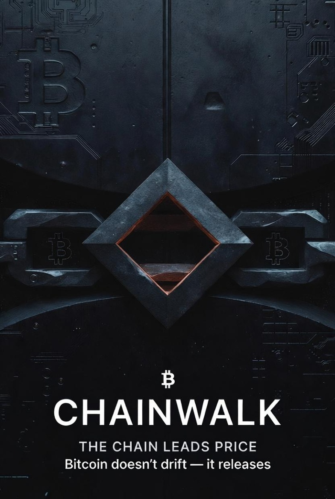

🜂 README.md — CHAINWALK
The Chain Leads Price

Bitcoin doesn’t drift — it releases

What is ChainWalk?

ChainWalk is the first sovereign oracle for Bitcoin — a measurement-based system that reads structural incentives directly from the protocol:

No price input

No sentiment

No TA overlays

ChainWalk measures cause, not reaction.

Where every other dashboard chases price, ChainWalk refuses it — and wins by letting the chain lead.

Why Does It Exist?

Bitcoin is not a market driven by opinion.

It is:

a compression engine

a custody sink

a miner-funded ratchet

a protocol that removes alternatives over time

ChainWalk captures the hidden signals of that system.

What Does It Measure?

ChainWalk tracks the four constraint fields governing Bitcoin’s possible futures:

Field	Meaning
CTI	Chain Tension Index — how tightly Bitcoin’s incentive coil is compressed
MTI	Miner Threshold Index — when miners stop absorbing stress and start leaning on price
IRQ	Irreversibility — how much optionality the system has left before the past dictates the future
REI	Resolution Field — how close the protocol is to forcing a regime outcome
UQI	Uncertainty Quotient — how many futures the system still permits

When these converge, Bitcoin stops trading.

It submits.

Why Sovereign?

A Sovereign Oracle is defined by the variable it excludes.

ChainWalk never takes price as input.

That means:

Markets cannot bribe it

It can be wrong — but cannot be influenced

Calibration is retrospective and honest

This is a new oracle class in monetary epistemology.

Core Outputs

Running ChainWalk produces:

📎 Spine Record (daily state vector)
📜 APEX Deck (full constraint report)
🖼 Scorecard (public posting surface)
📈 Calibration report (oracle honesty)
🚨 Alert rail (first irreversible event)
🧵 Compression tape (7-day narrative thread)

Install & Run
See [docs/INSTALL.md](docs/INSTALL.md) for detailed instructions.

git clone https://github.com/VitaAI-SCG/chainwalk
cd chainwalk
pip install -r requirements.txt
python CHAINWALK_DAILY_BRIEF.py

Daily output surfaces appear in:

/reports

Documentation
- [Installation Guide](docs/INSTALL.md)
- [Whitepaper](docs/WHITEPAPER.md)
- [Architecture](docs/ARCHITECTURE.md)
- [Glyph Codex](docs/GLYPH_CODEX.md)
- [Contributing](docs/CONTRIBUTING.md)
- [Constraint Map](docs/CONSTRAINT_MAP.md)

### Canon · The Long-Form Papers

If you want the full picture behind ChainWalk, read the Canon:

- [Technical Whitepaper](docs/canon/CHAINWALK_TECHNICAL_WHITEPAPER.md)
- [Math & Principles](docs/canon/CHAINWALK_MATH_PRINCIPLES.md)
- [Market Thesis](docs/canon/CHAINWALK_MARKET_THESIS.md)
- [Engineering Roadmap](docs/canon/CHAINWALK_ENGINEERING_ROADMAP.md)
- [Origin Story](docs/canon/CHAINWALK_ORIGIN_STORY.md)

Donations (optional, never required)

If this work saved you time, taught you something, or reshaped how you see Bitcoin:

bc1qn4h68x5327fmr4fvlv94t6vw0v8ck9z33m9jw8

ChainWalk is free and open forever.
If you choose to support it — you are literally funding a new class of oracle.

Status

Phase 6 complete — Constraint Geometry Closed

CTI, MTI, IRQ, REI, and UQI fully implemented

Oracle honesty calibration live

Sovereign oracle definition formalized

[Whitepaper](docs/WHITEPAPER.md) in progress

There is no second best.

Roadmap (Public Mode)
Phase	Status	Description
1–3	✔	Chain tension, miner pressure, regime incentives
4	✔	Irreversibility + Resolution engine
5	✔	Sovereign Oracle Surface
6	✔	Uncertainty Physics Engine (UQI)
7	🔒	Emergent Regime Forecasting
8	🔒	Machine-interpretable Oracle API
Contribute

Pull requests welcome — but understand:

This is not TA.

This is incentive geometry.

License

MIT — protocols deserve freedom

Remember

Price does not lead the chain.
The chain leads price.

🟧🟦🟥⬛⚫
